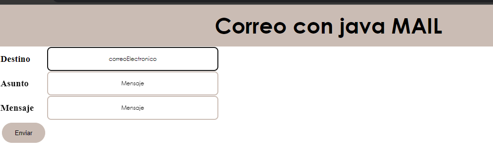
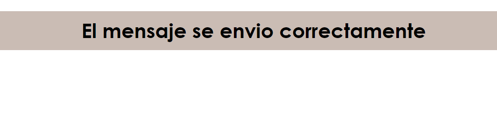
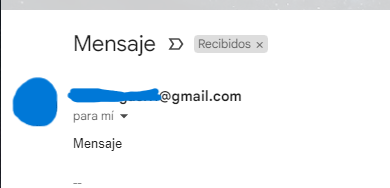

<h1 align="center"> Java Mail</h1>
Ejercicio de enviar correos con Java Mail

* En este programa se podra enviar un correo desde una aplicación web

 

 

 

## Construido con 🛠️

_Herramientas Utilizadas_

* [Java](https://www.java.com/es/) - Lenguaje para el BackEnd
* Se requiere de la importar Javax.Mail

## Autores ✒️

* **Karen Vargas** - *Trabajo Inicial* - [KarenVargas](https://github.com/Karen11Vargas)

